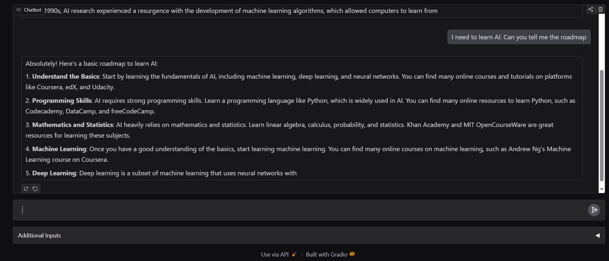

# 🧠 Smarter Chatbot

An **AI-powered conversational assistant** built with [Python](https://www.python.org/), [Gradio](https://www.gradio.app/), and [Hugging Face Transformers](https://huggingface.co/transformers/).  
The chatbot uses **Microsoft Phi-3-mini-4k-instruct** for generating **context-aware** and **human-like** responses.

---

## 📸 Demo
Here’s what the interface looks like:

)


---

## 🚀 Features
- **Intelligent Conversations** — Powered by Microsoft Phi-3-mini-4k-instruct.
- **Conversation Memory** — Remembers the last 3 user–assistant exchanges.
- **Customizable Parameters** — Control `max_tokens`, `temperature`, and `top_p`.
- **Interactive UI** — Simple and fast interface with Gradio.
- **Lightweight & Easy to Run** — No complex setup required.

---

## 🛠 Tech Stack
- **Language:** Python 3.10+
- **Libraries:** Gradio, Transformers, Hugging Face Hub
- **Model:** microsoft/Phi-3-mini-4k-instruct

---

## 📦 Installation

1️⃣ Clone the repository:
```bash
git clone https://github.com/USERNAME/smarter-chatbot.git
cd smarter-chatbot
